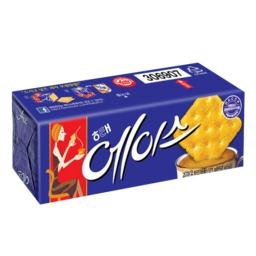

# 📰 Snack Backend

> 네이버 뉴스 기사를 크롤링하여 요약본, 어려운 용어 해설, 퀴즈, 스크랩, 맞춤형 기사 피드를 제공하는 **뉴스 리딩 보조 서비스**

---

## 🚀 서비스 소개

**Snack**은 사용자가 뉴스를 더 쉽고 재미있게 읽을 수 있도록 돕는 서비스입니다.  
네이버 API를 활용해 기사를 수집하고, 각 기사에 대한 요약·용어 해설·퀴즈를 자동으로 생성합니다.  
또한 사용자의 클릭·스크랩·검색 로그를 분석해 맞춤형 피드를 제공합니다.

---
## 팀원 소개

|                          |         |                                                |
|--------------------------|---------|------------------------------------------------|
|   | 크롤링 · 스크랩 | [@chaewon](https://github.com/chaewon)         |
|   | 피드 · 검색 · 메모 | [@padoz3](https://github.com/padoz3)           |
|   | 인증 · 사용자 관리 | [@danaggero](https://github.com/danaggero)             |
|  | 소셜 로그인 · 퀴즈| [@LABYRINTH3](https://github.com/LABYRINTH3)         |
|         | 피드 · 검색 · 인프라 | [@weeeeestern](https://github.com/weeeeestern) |


## 🛠 기술 스택

### Backend
- Java 21
- Spring Boot
- Spring Security, JWT
- Spring Data JPA
- MySQL
- Gradle

### Infra & DevOps
- AWS EC2, RDS, S3
- Nginx
- Docker, Docker Compose
- GitHub Actions (CI/CD)

### NLP & Data
- Python FastAPI (TF-IDF + 의미 벡터화)
- 네이버 뉴스 API

---
## 🏗 서비스 아키텍쳐


---
## 📌 주요 기능 
- https://snacknews.site/swagger-ui/index.html

### 인증 & 사용자
- 회원가입, 로그인/로그아웃
- Access/Refresh 토큰 재발급
- 구글 소셜 로그인
- 이메일/비밀번호 변경
- 내 정보 조회·수정
- 프로필 이미지 업로드/삭제

### 기사
- 네이버 뉴스 기사 크롤링 상태 조회
- 기사 요약 생성
- 기사 정보·용어 조회
- 기사 검색 (키워드 기반, 의미 기반)
- 관련 기사 조회

### 스크랩 & 공유
- 스크랩 등록/취소
- 스크랩 여부 확인
- 스크랩 → 기사 리다이렉트
- 공유 URL 생성/조회

### 맞춤형 피드
- 메인 피드 (카테고리별 기사)
- 맞춤형 피드 (사용자 행동 기반 추천)

### 퀴즈
- 기사별 퀴즈 조회
- 퀴즈 제출

### 메모
- 기사별 메모 작성/수정/삭제
- 메모 목록/조회
- 메모 → 기사 리다이렉트

### 기타
- 이미지 S3 업로드 & Presigned URL 발급
- 이메일 인증 코드 발급/검증

---

## 📂 프로젝트 구조

```plaintext
src/
└── main/
    ├── java/umc/snack/
    │   ├── common/          # 공통 설정, 예외, 응답
    │   ├── controller/      # API 엔드포인트
    │   ├── service/         # 비즈니스 로직
    │   ├── repository/      # DB 접근
    │   ├── domain/          # 엔티티 & DTO
    │   └── SnackApplication.java
    └── resources/
        └── application.yml
```

## 🌱 브랜치 전략
**전략**: GitHub Flow
- `main`: 배포용 안정 브랜치
- `feat/기능명`: 기능 개발 브랜치
- `develop`: 통합 개발 브랜치

**규칙**
- `develop`에서 분기 → 기능 개발 → PR 생성 → 리뷰 후 머지
- `main` 직접 푸시 금지

---

## 💬 커밋 컨벤션

`[타입] 작업 내용 close #이슈번호`

| Type     | 설명 |
|----------|------|
| feat     | 새로운 기능 |
| fix      | 버그 수정 |
| refactor | 리팩토링 |
| test     | 테스트 코드 |
| docs     | 문서 수정 |
| chore    | 빌드/설정 |
| style    | 코드 스타일 변경 |
| ci       | CI/CD 수정 |
| perf     | 성능 개선 |
| remove   | 불필요한 코드/파일 삭제 |
